# FedEx Smart DCA Portal
### AI-Driven Debt Collection & Agency Governance Portal & Predictive Allocation
*📽️demo video:*

https://github.com/user-attachments/assets/b80cbe8f-0a2d-4599-9d36-bb4313dc2025

*🔗code:*
https://github.com/pranayjain-13/FedEx-Smart-DCA-Portal/blob/87d5903847bbd0c16ea8c9a8447bcb1b8f06ed0a/app.py

## 📋 Project Overview
The **FedEx Intelligent Recovery Hub** is a next-generation solution for managing Debt Collection Agencies (DCAs). It replaces manual, spreadsheet-based workflows with a secure, automated portal that uses **Predictive AI Scoring** to optimize debt recovery.

### 💡 The Problem
FedEx manages thousands of overdue accounts. Traditional methods includes slow recovery cycles, minimal audit trail no real-time visibility into DCA Perforfance , and manual case allocation.

### ✅ The Solution
Our Portal provides:
1.  **AI-Driven Allocation:** Automatically scores cases to match them with the best-suited agency.
2.  **Role-Based Portals:** Secure gateways for agencies to search and track their allotted cases and also update the status of the cases.
3.  **Executive Command Center:** Real-time visibility into global recovery progress through live progress tracking and also audit log of every step.

---

## 📑Pipeline
1. Ingestion: Uploading the CV/XLSX.
2. Processing: Cleaning headers and calculating Al scores.
3. Allocation: Sorting cases into specific agencies (Apex, Global, Swift).
4. Governance: Capturing every change in the Audit Log.

```mermaid
graph TD
    A[📂 CSV Ingestion] --> B{🛡️ VoidOps AI Engine}
    B -->|Calculate Score| C[📊 BI Scoring - PPS/DPS]
    B -->|Categorize Risk| D[⚠️ High/Med/Low Risk]
    C --> E[🔒 Secure Agency Gateway]
    D --> E
    E -->|Auth: Apex| F[🏢 Apex Collections View]
    E -->|Auth: Global| G[🏢 Global Recovery View]
    E -->|Auth: Admin| H[👑 FedEx Executive Dashboard]
    
    style B fill:#4D148C,color:#fff
    style H fill:#FF6200,color:#fff 

```

```mermaid
graph TD
    In[📥 Invoiced Debt] --> Formula[fa:fa-calculator PPS Calculation]
    Formula --> H{PPS Score?}
    H -->|> 85| Tier1[🏢 Apex Collections - High Priority]
    H -->|75 - 85| Tier2[🏢 Global Recovery - Standard]
    H -->|65 - 75| Tier3[🏢 Swift Debt Limited - Complex/Legal]
    H -->|55 - 65| Tier4[🏢 Axis Collections - Complex/Legal]
    H -->| <55 | Tier5[🏢 Banking Corporatin - Complex/Legal]
    

```

 
## 🧠 The AI Scoring Engine(Model)
The heart of the system is our **Predictive Recovery Index**. We use a specific formula to calculate the probability of success:

$$Score = 100 - (Age \times 0.4) - (Amount / 3000)$$

### Why this formula?
* **The 0.4 Time Factor:** In logistics, debt "spoils" quickly. This factor ensures that for every 30 days of delay, the recovery score drops by 12 points. This prioritizes **liquidity** and prevents accounts from becoming "bad debt."
* **The 3000 Complexity Factor:** Large invoices are often harder to collect due to corporate approval layers. This factor ensures high-value accounts are flagged for specialized agency handling.
---

## 🚀 Key Features

#### 🏢 Agency Gateway (Search & Update)
* **Search-to-Select:** Agencies can instantly find specific Case IDs without scrolling through thousands of rows.
* **Secure Filtering:** Built-in data privacy ensures Agencies only see their own portfolio.
* **Instant Sync:** When an agency marks a case as "Closed," the executive progress bar updates in real-time.

#### 📊 Executive Overview
* **Global Recovery Progress Bar:** A high-level visual of how much of the debt portfolio has been successfully recovered.
* **Portfolio Valuation:** Clear breakdown of "Total Value" vs. "Pending Value," helping management forecast cash flow accurately.

#### 📜 Governance Audit Log
* **100% Accountability:** Every import, search, and status update is timestamped and logged, solving the "minimal audit trail" pain point.

---

## 🛠️ Tech Stack
* **Framework:** Streamlit (Python)
* **Data Analysis:** Pandas, NumPy
* **Visualizations:** Plotly Express
* **Deployment:** GitHub Codespaces / Streamlit Cloud

---

## 🏃‍♂️ Setup Instructions
1. Clone the repo: `git clone https://github.com/pranayjain-13/FedEx-Smart-DCA-Portal.git`
2. Install dependencies: `pip install -r requirements.txt`
3. Launch: `streamlit run app.py`
4. Also, to view dashboards and analytics you can download this test file
[Demo clients.csv](https://github.com/user-attachments/files/24540041/Demo.clients.csv)

*Pranay Jain(Team Lead) , Pranshu Rana(Team Member) / VoidOps | FedEx Hackathon 2026*
